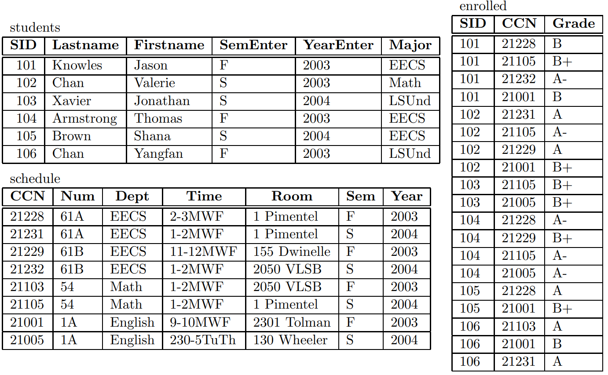

[](https://classroom.github.com/online_ide?assignment_repo_id=9475714&assignment_repo_type=AssignmentRepo)
# CSC3170 Course Project

## Project Overall Description

This is our implementation for the course project of CSC3170, 2022 Fall, CUHK(SZ). For details of the project, you can refer to [project-description.md](project-description.md). In this project, we will utilize what we learned in the lectures and tutorials in the course, and implement either one of the following major jobs:

- [ ] **Application with Database System(s)**
- [x] **Implementation of a Database System**

In this project, our group creates a miniature relational database management system (DBMS) similar to [UCB CS61B, Fall 2014 project](https://inst.eecs.berkeley.edu/~cs61b/fa14/hw/proj1.pdf). Moreover, we adopt identical commands with the SQL language to achieve CRUD (Create, read, update and delete) operations on the tables. Our group decided to use C++ language instead of the original Java language templates in the [CS61B project](https://inst.eecs.berkeley.edu/~cs61b/fa14/hw/code/proj1/). This means we have built our project from the ground up and make our own structure for the files and use different data structures as we see fit in the C++ language. 


## Team Members

Our team consists of the following members, listed in the table below (the team leader is shown in the first row, and is marked with 🚩 behind his/her name):

<!-- change the info below to be the real case -->

| Student ID | Student Name   | Email                          | Github Username |
| :----------: | :--------------: | :------------------------------: | :----------------:|
| 120090727  | 李珈祺 🚩        | 120090727@link.cuhk.edu.cn     | LJQ0727          |
| 120090027  | 刘起            |    120090027@link.cuhk.edu.cn  | LittleShaco      |
| 119030043  | 连珈玮          | 119030043@link.cuhk.edu.cn     | jlianxm          |
| 120090874  | 杨亮            | 120090874@link.cuhk.edu.cn     | yangbright-2001 |
| 120040022  | Darren Boesono | 120040022@link.cuhk.edu.cn     | dboesono        |
| 120040006  |Yohanes James   | 120040006@link.cuhk.edu.cn     | YohanesJames    |
| 120090231  |王茗萱           | 3096968424@qq.com              | helloworldlgu   |

### Task allocation for team members
Please refer to [task-allocation.md](task-allocation.md) for the detailed task allocation throughout the process of building our project.

## Building and running the project
We use `CMake` to build our project, which allows our Databse implementation to have cross-platform support. 

- To build from the source, run:
    ```bash
    mkdir build && cd build
    cmake ..
    ```

- To run the executable file, goto the `build/simple_db` folder, run:
    ```bash
    make
    ./simple_db
    ```
- To run the unit test, go to the `build/testing/unit_test` folder, run:
    ```bash
    make
    ./
    ```


## Project File structure

The source codes for our Database Command-line implementation is located in the `simple_db` directory. Inside this directory, our header files are included in the `include` folder, and our `cpp` source files are included in the `src` folder. Here are the classes we have defined and their descriptions, with the class names same as the file names:

- `Row` class: serves as the underlying storage unit for information about tables in the database, recording row information.
- `SchemaItem` class: records tables’ schemas in the database.
- `Table` class: A data structure that stores tables in a database. It contains three attributes, the rows (`Row` class) to record the row information, the schema (`SchemaItem` class) to record the schema, and the database (`Database` class) to record the database which the table belongs. It also contains some methods, such as insert, print, delete.
- `CommandInterpreter` class: Used to accept and execute commands. Contains the specific implementation method of the command. (exit, select, help…)
- `Database` class: As a whole database, which contains instances of the Table and CommandInterpreter classes as attributes.
`main.cpp`: This is the driver code for the application.

## Implementation details
Each class has some functionalities. First of all, the class Row consists of getValues and setValues. SchemaItem consists of getName, getType, and getTypeFromString. Class Table will use both row and SchemaItem class. The class table will consist of row operations like getting, removing, and inserting the row. Furthermore, it is also used to print, load, and save the table. This table class will be used to construct the database class. The database class has several functionalities: add, remove, and get a table. Moreover, it also has functions to execute and save the database. For the CommandInterpreter, it is used to interpret the user input and execute the command to produce the desired result. It covers some standard syntaxes similar to SQL, such as create, delete, insert, load, store, print, and many more. Furthermore, it also has some additional features like guessing the user input.

In the end, our database management system will realize two-way data transfer with .db file , create tables, insert rows into existing tables, print tables and other functions. In addition to this, we will implement Select clauses, which are used in select statements and in create statements. They denote tables whose information is selected from other tables. 

## Command Specifications

- SQL
    - create new table: `create table <table_name> <attr1>(<type1>), <attr2>(<type2>...)`
    - insert data into table: `insert into <table_name> values ...`
    - query: 
        - select all attributes from table: `select * from <table_name>`
        - select explicit attributes from table: `select <attr1>, <attr2>... from <table_name>`
        - select with conditions: `select <attr1>, <attr2>... from <table_name> where <condition>`
        - select with and/on connected conditions: `select <attr1>, <attr2>... from <table_name> where <condition1> and/or <condition2>`
        - select from multiple tables (achieving natural inner join): `select <attr1>, <attr2>... from <table_name1>, <table_name2>... where <condition1> and/or <condition2>`
    - delete table: `delete table <table_name>`
    - delete row: `delete from <table_name> where <condition>`
    - delete all rows but preserve the empty table: `delete from <table_name>`
- IO
    - `load <table_name>`: load the table from disk storage to the database. If the table is not availble on disk, print out error.
    - `store <table_name>`: store the table onto disk, such that it could be brought back by using the load command. If there is no such table, print out error.
- Miscellaneous
    - `print <table_name>`: print out all content of the table. If there is no such table, print out error.
    - `quit` or `q` or `exit`
    - `help`: print out help message


### Additional commands
Switch database

## Project Demo
<!-- include screenshots -->


## Additional Features
### Errorneous command correction
### Crash prevention
When a file is not present when loaded, 
When a table is not present
### GUI
<!-- Please fill in  -->


