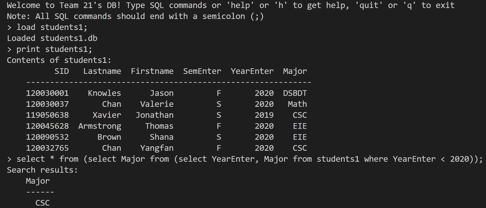

[](https://classroom.github.com/online_ide?assignment_repo_id=9475714&assignment_repo_type=AssignmentRepo)
# CSC3170 Course Project

## Project Overall Description

This is our implementation for the course project of CSC3170, 2022 Fall, CUHK(SZ). For details of the project, you can refer to [project-description.md](project-description.md). In this project, we will utilize what we learned in the lectures and tutorials in the course, and implement either one of the following major jobs:

- [ ] **Application with Database System(s)**
- [x] **Implementation of a Database System**

In this project, our group chooses Option 3 and creates a miniature relational database management system (DBMS) similar to [UCB CS61B, Fall 2014 project](https://inst.eecs.berkeley.edu/~cs61b/fa14/hw/proj1.pdf). Moreover, we adopt identical commands with the SQL language to achieve CRUD (Create, read, update and delete) operations on the tables. Our group decided to use C++ language instead of the original [Java templates in the CS61B project](https://inst.eecs.berkeley.edu/~cs61b/fa14/hw/code/proj1/). This means we have built our project from the ground up and make our own structure for organizing the repository and use different data structures as we see fit in the C++ language. 

## Project Presentation
Our team members have presented on our database's implementations and additional functions. The full video is publicly available at [this Bilibili link](https://www.bilibili.com/video/BV1jM41117Lt/). As a supplement, the pdf version of the slides is available at [this link](presentation/presentation.pdf). Because all our domestic team members are currently under COVID-19, after careful consideration about the condition of our presenters, we decided that all presenters in the zoom presentation can keep their camera off.

## Team Members

Our team consists of the following members, listed in the table below (the team leader is shown in the first row, and is marked with 🚩 behind his/her name):

<!-- change the info below to be the real case -->

| Student ID | Student Name   | Email                          | Github Username |
| :----------: | :--------------: | :------------------------------: | :----------------:|
| 120090727  | 李珈祺 🚩        | 120090727@link.cuhk.edu.cn     | LJQ0727          |
| 120090027  | 刘起            |    120090027@link.cuhk.edu.cn  | LittleShaco      |
| 119030043  | 连珈玮          | 119030043@link.cuhk.edu.cn     | jlianxm          |
| 120090874  | 杨亮            | 120090874@link.cuhk.edu.cn     | yangbright-2001 |
| 120040022  | Darren Boesono | darrenboesono28@gmail.com     | dboesono        |
| 120040006  |Yohanes James   | 120040006@link.cuhk.edu.cn     | YohanesJames    |
| 120090231  |王茗萱           | 3096968424@qq.com              | helloworldlgu   |

### Task allocation for team members
Please refer to [task-allocation.md](task-allocation.md) for the detailed task allocation throughout the process of building our project.

## Building and running the project
We use `CMake` to build our project, which allows our Database implementation to have cross-platform support. First, please make sure your computer has `CMake` installed or install it [here](https://cmake.org/install/). If you're on a Windows machine, we recommand additionally installing MinGW following [this link](https://www.ics.uci.edu/~pattis/common/handouts/mingweclipse/mingw.html).

- To build from source on macOS or linux, please go to the project root directory, then type the following commands on any terminal:
    ```bash
    mkdir build && cd build
    cmake ..
    make
    cd ..
    ```

- To build from source on Windows machines with MinGW installed, first go to the project root directory by `cd` into it, then type the following commands on PowerShell:

    ```bash
    mkdir build
    cd build
    cmake -G "MinGW Makefiles" ..
    mingw32-make
    cd ..
    ```

For Windows users, alternatively, if you have Visual Studio with Visual C++ installed, you could set the CMake to output a Visual Studio Solution file and open and build with Visual Studio. Here we do not illustrate this method further.


- To run the executable file, first ensure your current directory is the project root directory, then run:
    ```bash
    cd build/simple_db
    ./simple_db
    cd ../..
    ```
<!-- - To run the unit test, first ensure your current directory is the project root directory, then run:
    ```bash
    cd build/testing/unit_test
    ./simple_db_test
    cd ../..
    ``` -->

## Project File structure

The source codes for our Database Command-line implementation is located in the `simple_db` directory. Inside this directory, our header files are included in the `include` folder, and our `cpp` source files are included in the `src` folder. Here are the classes we have defined and their descriptions, with the class names same as the file names:

- `Row` class: serves as the underlying storage unit for information about tables in the database, recording row information.
- `SchemaItem` class: records tables’ schemas in the database.
- `Table` class: A data structure that stores tables in a database. It contains three attributes, the rows (`Row` class) to record the row information, the schema (`SchemaItem` class) to record the schema, and the database (`Database` class) to record the database which the table belongs. It also contains some methods, such as insert, print, delete.
- `CommandInterpreter` class: Used to accept and execute commands. Contains the specific implementation method of the command. (create, load, store, insert, print, select, delete, quit/exit…)
- `Database` class: As a whole database, which contains instances of the Table and CommandInterpreter classes as attributes.
`main.cpp`: This is the driver code for the application.

## Implementation details

We adopt the object-oriented approach for our implementation.
The following figure show the workflow of our database. 

To implement the specific database and related methods, we divide it into a number of classes, such as `Row` class, `SchemaItem` class, `Table` class, `CommandInterpreter` class and `Database` class.

The `Row` class serves as the underlying storage unit for information about tables in the database, and it records row information. `SchemaItem` class is used to record tables’ schemas. Its structure and methods are similar to `Row` class. The class `Table` consists of row operations including getting, removing, and inserting the row. Furthermore, it is also used to print, load, and save the table. This table class will be used to construct the database class. The `database` class has several functionalities: add, remove, and get a table. Moreover, it also has functions to execute and save the database. For the `CommandInterpreter`, it is used to interpret the user input and execute the command to produce the desired result. It covers some standard syntaxes similar to SQL, such as create, delete, insert, select, load, store, print, etc. It first decomposes the command using the token variable with the function `tokenizer()`,(like the split() function in python), and then processes the parsed commands case by case. 


## Command Specifications
Here we list the commands our database supports. Like most Database Management Systems, our database supports SQL keywords written in uppercase, and they will have the same effect as the lowercase ones as listed below.

- SQL
    - create new table: 
        - create an empty table with the given name and column name: `create table <table_name> <attr1>(<type1>), <attr2>(<type2>...)`
        - create a table with columns and contents produced by the select clause: `create table <table_name> as <select clause>`
    - insert data into table: `insert into <table_name> values ...`
    - query: 
        - select all attributes from table: `select * from <table_name>`
        - select explicit attributes from table: `select <attr1>, <attr2>... from <table_name>`
        - select with conditions: `select <attr1>, <attr2>... from <table_name> where <condition>`. The operator in the `<condition>` should be surrounded by whitespaces, for example, "a = 1" instead of "a=1".
        - select with and/on connected conditions: `select <attr1>, <attr2>... from <table_name> where <condition1> and/or <condition2>`. The operator in the `<condition>` should be surrounded by whitespaces, for example, "a = 1" instead of "a=1".
        - select from multiple tables (achieving natural inner join): `select <attr1>, <attr2>... from <table_name1>, <table_name2>... where <condition1> and/or <condition2>`
        - select with nesting of subqueries: `select <attr1>, <attr2>... from (select <attr3>, <attr4>... from <table_name1>, <table_name2> where <condition1> and/or <condition2>...)`
    - delete table: `delete table <table_name>`
    - delete specific rows: `delete from <table_name> where <condition>`
    - delete all rows but preserve the empty table: `delete from <table_name>`
- IO
    - `load <table_name>`: load the table from disk storage to the database. If the table is not availble on disk, print out error.
    - `store <table_name>`: store the table onto disk, such that it could be brought back by using the load command. If there is no such table, print out error.
- Miscellaneous
    - `print <table_name>`: print out all content of the table. If there is no such table, print out error.
    - `quit` or `q` or `exit`: quit the program
    - `help`: print out help message
    - Comments: if a line starts with `/*` and ends with `*/`, this line will be ignored by the database
    - Multi-line content: if a line does not end with a semicolon (;), the database will recoginize it as an unfinished part of a command, concatenating all following lines to the command until an ending line with a semicolon (;). This feature is similar to those in MySQL command-line interface.


# Project Demo

Consider a scenario where we want to use our database to record information about students and courses in our university. We have already provided three sample tables with information and can be directly loaded: `students1`, `enrolled1`, and `schedule1`.


We could use the following query to extract all recorded courses taught by SDS (School of Data Science):


From the above table, we could extract the courses taught in Year 2022:


We could try a more complicated command by extracting the grades of the studens who took the above course, “data-structures”:


We could create a new table and insert data into it, store it to the disk so that the next time we could restore the contents we have added.


We could verify this by restarting the application and load the “department” table. Here we can also delete specific row in a way similar to the `select` clause.


Because a `select` clause returns a table, we could also utilize the returned table as a part of the `select`, resulting in a cascaded select:



# Testing the database
We have thoroughly tested the correctness of the various commands of our database manually. If you wish to verify the correctness of our database implementation, we recommend first follow the input command sequence in the last section (Project Demo), where the result is straightforward to verify. 

We have also provided some of our testing scripts in the `testing/` folder, which provides variations to test the robustness of our database. To utilize them, you could follow the sequence of `create_table.sql` -> `insert_into.sql` -> other `.sql` files. You could paste the commands in the files, modify them if you wish, and examine the results.

There could still be some edge cases which our database does not cover, and we welcome any improvement suggestions in the form of Github Issues or Pull Requests.

# Additional Features

Besides the handling of query commands, we develop additional features in our database system.

## Spelling error corrections

Our database can provide “hints” for the user‘s command if the user gives a wrong one, that is, predict the command that the user may want to type in.

Implementation detail:

1. function achieved by the `spellingErrorCorrection()` function
2. compare the user input with each of the standard SQL commands (select, create, print…) by invoking the `lcs()` function
3. the function `lcs(string a, string b)` obtains the length of longest common substring between 2 strings
4. the SQL command with lcs() value larger than threshold will be the possible input command that the user may want, and give user a hint 


## Crash prevention

Our database can identify erroreous cases and print error messages instead of crashing, adding robustness to our database. Such scenarios include:

1. user operates(select, print, store…) on a table that does not exist
2. user “insert” values with numbers that does not match the number of columns

The following screenshots illustrates the above features: 


## Database GUI design

GUI(Graphical User Interface) is a feature for many modern Database Management Systems. This includes the MongoDB Compass for MongoDB, MySQL Workbench for MySQL, etc. Database GUIs provide simple, intuitive ways for users and developers to interact with the databases. 

In this project, we also seek to explore more possibilities out of our original command-line implementation. Thus, we have also designed two GUI windows using Qt for interacting with our database. While we only designed the front-end GUI, we expect that it can be smoothly integrated with our command-line sources and can be a further improvement of this project. The source codes of the two GUI windows we have designed is located in the `gui/` directory, with detailed report and demo at its [README.md](gui/README.md) file.

# Summary

The implementation of this project is an unforgettable and successful one. In this project, we collaboratively utilized our own strengths to finish implementing the SQL functions ourselves in C++. 

As we finish the journey, we want to thank our instructor in the CSC3170 course, Clement Leung, and our kind TA, Whisky, for giving us such opportunity and their substantial help during our implementation. We want to thank every team member for actively contributing to this project. Here is a summary of their major contributions: 

| Student Name | Major contributions |
| --- | --- |
| 李珈祺 | Team leader, provided initial project structure and header files, implemented the codes for create table, insert, and pretty-printing the table. Tested the database and helped with writing the README.md |
| 刘起 | Implemented the codes for select clause, implemented the load and store and print features, helped with testing and adding robustness support |
| 杨亮 | Wrote presentation script, Powerpoint and helped with writing the README.md, implemented the spelling error corrections and helped enhance crash prevention features |
| 王茗萱 | Wrote presentation script, Powerpoint and helped with writing the README.md, implemented the seplling error corrections and helped enhance crash prevention features |
| 连珈玮 | Implemented the Database class and helped with implementing load and store features, organized our repository structure neatly, wrote CMake script to build the whole project, added unit test module for testing |
| Darren Boesono | Designed and implemented the two GUI windows in Qt, finished a detailed report on that |
| Yohanes James | Implemented the Table and Database class, provided the SQL test cases to help testing the database, helped with report writing |

This project deepens our knowledge of a database system. There is indeed something that needs to be improved in our project, such as the efficiency issue, and we still need better support for larger-scale databases. Hopefully, we can make it better in the future.

