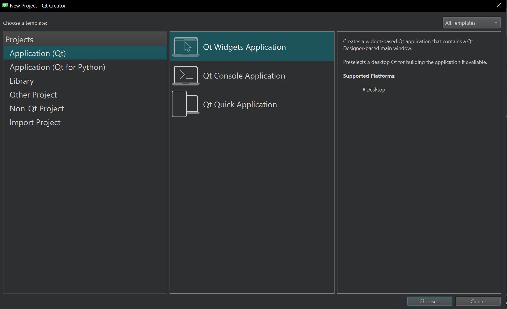
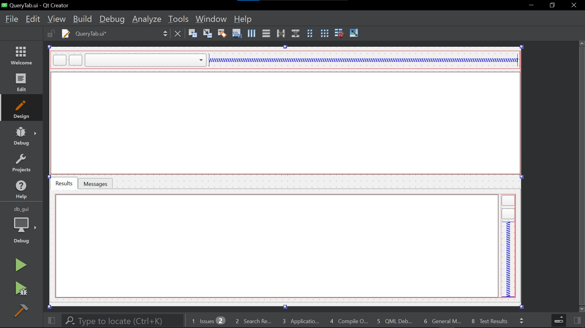
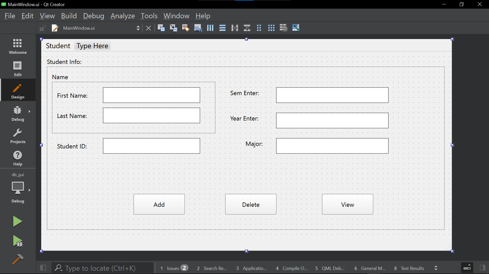

# What is Qt creator?
Qt Creator is a cross-platform integrated development environment (IDE) that is part of the Qt framework. It is designed to enable the development of desktop, mobile, and embedded applications with GUI and is used to create applications for various platforms using the C++ programming language.

One of the key features of Qt Creator is its support for the Qt framework, which provides a set of libraries and tools for building graphical user interfaces (GUIs) and other applications. The Qt framework includes a range of GUI widgets, such as buttons, menus, and dialog boxes, that can be used to create a user-friendly interface for a database application.

Qt Creator also provides a range of tools and features that can be useful when developing a database application, such as:

* A visual editor for designing the layout of the user interface
* A debugger for finding and fixing errors in the code
* A code editor with syntax highlighting and code completion
* A project manager for organizing files and resources
* Integration with version control systems, such as Git

By using Qt Creator, fellow developers can take advantage of these tools and features to create a professional-quality GUI for their database implementation. Developers can also use the visual editor to design the layout of the user interface, and then use the code editor to implement the logic for interacting with the database. The debugger can also help find and fix any errors in the code, and the project manager can help keep files organized.

# Basic steps on designing the GUI
Here are the steps on how to use Qt Creator to design a GUI for a database application in C++:

1. Install Qt Creator on your computer. You can download the latest version of Qt Creator from the Qt website (https://www.qt.io/download).

2. Open Qt Creator and create a new project. Select "C++" as the language and "Qt Widgets Application" as the project template.

3. Design the layout of your user interface using the visual editor. You can use the various GUI widgets provided by the Qt framework, such as buttons, labels, and tables, to create the layout of your application.

4. Add logic to your application by implementing event handlers for the various GUI widgets. For example, you can implement a "add" or "run" button that inserts data into the database when clicked and run specified query, respectively.

5. Connect your GUI to the source code of the project for implementing the functionality of the implemented database management system.

6. Test your application by running it in Qt Creator. You can start writing queries described in the project description. Furthermore, You can also use the debugger to find and fix any errors in the code, and use the project manager to organize your files and resources.

# Building the GUI
1. Query Command Line

This UI design allows user to type in their queries that is available from the project's source code and it will return the result table. Users will write queries will write their queries in the first big white box and the executed query will return a result table in the second box. For example when using a select statement using a specified conditional clause will return a new (unnamed) table
consisting of the named columns from the given table from all rows that satisfy the condition clause.
2. Loading the Student Data

In this UI, users will able to add students to the database. Student information includes their first and last name, student roll number, semester entered, year entered, and their major. Users can either view, delete, add students to the database.
# User Journey
1. Student Data

In this GUI, the user can interact with interface in the following steps:
* First Name: Input the first name of the specified students
* Last Name: Input the last name of the specified students. For example, if the user wants to input the student "Jason Knowles", the user will input "Jason" in the First Name section and "Knowles" in the Last Name section.
* Student ID: The user may input the unique roll ID of a specified student.
* Sem Enter: Users will input the semester when the specified student has entered. Users will input either "F" or "S" in the section ("S" refers to summer and "F" refers to Fall)
* Year Enter: The user may input the year where the specified student has been enrolled to the university
* Major: the user will input the abbreviated major name of a specific student. For example, if a student majors in Electrical Engineering & Computer Science, then the user will type in "EECS" in the major section.
* Add: When the user clicks the "Add" button it will add the specified student to the database.
* Delete: When the user clicks the "Delete" button it will remove the specified student from the database.
* View: When the user clicks the "View" button it will output the unique row of from the database containing the student's information.
# Further Improvement
These GUIs can be added to the backend of the command-line interface and can be a further improvement of this project.