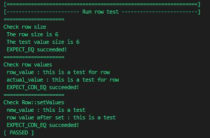
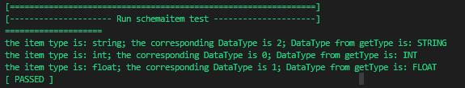
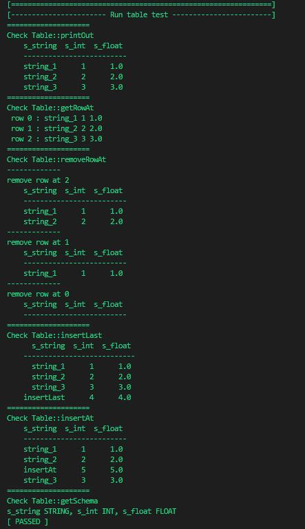
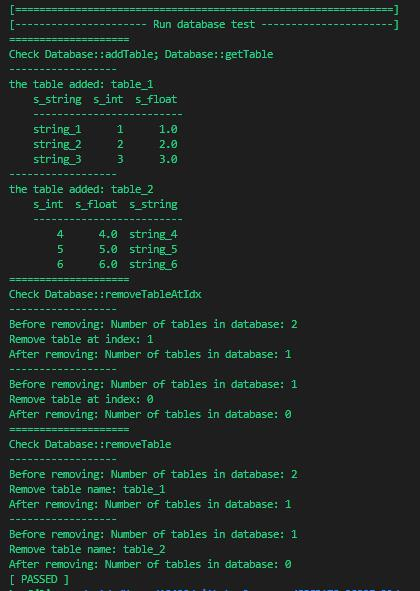

# Unit Test

This is a simple framework for unit test. The components in test.h are modified from 
[MyTinySTL](https://github.com/Alinshans/MyTinySTL/blob/master/Test/test.h)

## Output
- Row test:   
    
- SchemaItem test:   
    
- Table test:   
    
- Database test:   
    

## What we have tested
- [x] [Row class](Row_test.h)
  - [x] getValues
  - [x] setValues
- [x] [SchemaItem class](Schemaitem_test.h)
  - [x] getName
  - [x] getType
  - [x] getTypeFromString
- [x] [Table class](Table_test.h)
  - [x] printOut
  - [x] getRowAt
  - [x] removeRowAt
  - [x] insertLast
  - [x] insertAt
  - [x] getSize
  - [x] getSchema
  - [ ] loadFromFile
  - [ ] saveToFile
- [x] [Database class](Database_test.h)
  - [x] addTable
  - [x] getTable
  - [x] removeTableAtIdx
  - [x] removeTable
  - [ ] execute
  - [ ] saveDatabase
  - [ ] start
- [ ] CommandInterpreter class